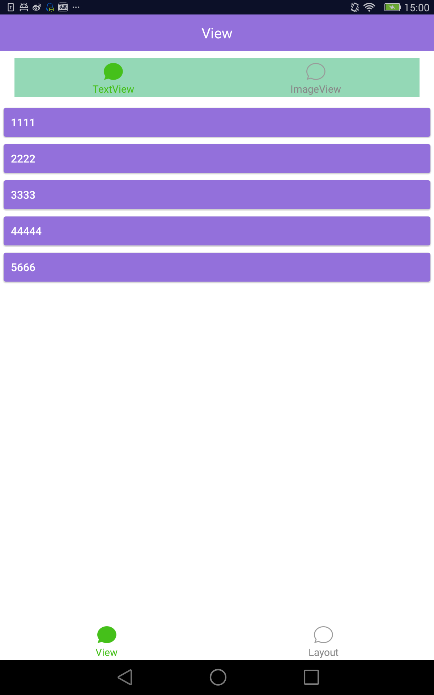
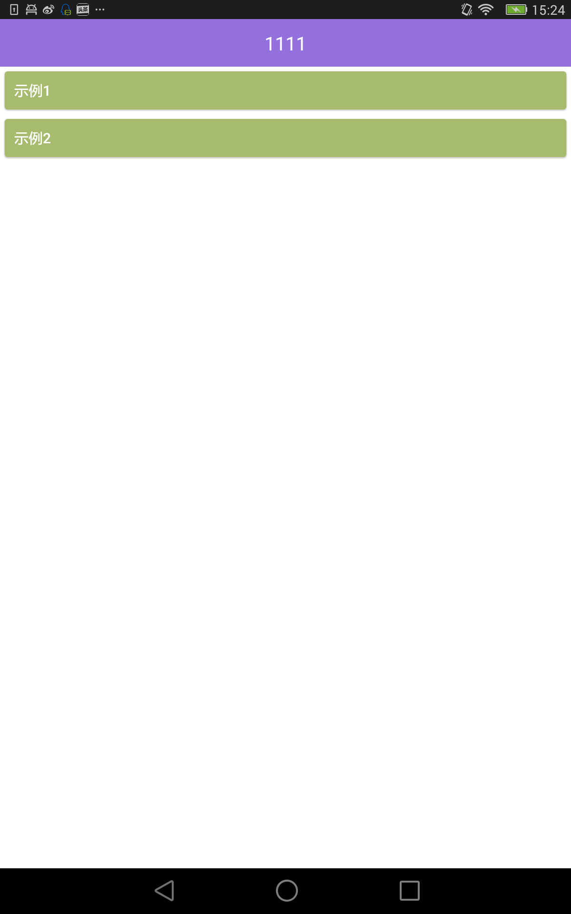
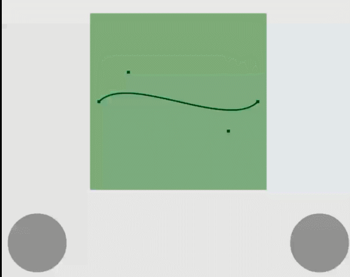

# ayo-menu
写demo所用的基本框架，以ViewPager嵌套ViewPager，任意配置菜单，可以方便的分类罗列demo

没整到jcenter上，暂时就用aar包吧，也挺省劲：[下载地址](https://github.com/cowthan/ayo-menu/blob/master/img/ayo-menu-lib-release.aar?raw=true)  
下载下来文件名是：ayo-menu-lib-release.aar，拷到libs目录里  
然后在build.gradle里引入：
```
repositories {
    flatDir {
        dirs 'libs'
    }
}

compile(name:'ayo-menu-lib-release', ext:'aar')
```


## 分类菜单功能

看图：  


用法，继承MainPagerActivity，自己在init()方法里配置菜单
```java

public class MainActivity extends MainPagerActivity {

    private List<Menu> menus;

    @Override
    protected void onCreate(Bundle savedInstanceState) {
        init();
        super.onCreate(savedInstanceState);
    }
    
    private void init(){
        menus = new ArrayList<Menu>();

        ///--------------------------菜单
        Menu m = new Menu("View", R.drawable.weixin_normal, R.drawable.weixin_pressed);
        menus.add(m);
        {
            MenuItem menuItem = new MenuItem("TextView", R.drawable.weixin_normal, R.drawable.weixin_pressed);
            m.addMenuItem(menuItem);
            {
                menuItem.addLeaf(new Leaf("1111", "", null));
                menuItem.addLeaf(new Leaf("2222", "", null));
                menuItem.addLeaf(new Leaf("3333", "", null));
                menuItem.addLeaf(new Leaf("44444", "", null));
                menuItem.addLeaf(new Leaf("5666", "", null));
            }

            menuItem = new MenuItem("ImageView", R.drawable.weixin_normal, R.drawable.weixin_pressed);
            m.addMenuItem(menuItem);
            {
                menuItem.addLeaf(new Leaf("1111", "", null));
                menuItem.addLeaf(new Leaf("2222", "", null));
                menuItem.addLeaf(new Leaf("3333", "", null));
                menuItem.addLeaf(new Leaf("44444", "", null));
                menuItem.addLeaf(new Leaf("5666", "", null));
            }

        }

        ///--------------------------菜单
        m = new Menu("Layout", R.drawable.weixin_normal, R.drawable.weixin_pressed);
        menus.add(m);
        {
            MenuItem menuItem = new MenuItem("官方", R.drawable.weixin_normal, R.drawable.weixin_pressed);
            m.addMenuItem(menuItem);
            {
                menuItem.addLeaf(new Leaf("1111", "", null));
                menuItem.addLeaf(new Leaf("2222", "", null));
                menuItem.addLeaf(new Leaf("3333", "", null));
                menuItem.addLeaf(new Leaf("44444", "", null));
                menuItem.addLeaf(new Leaf("5666", "", null));
            }

            menuItem = new MenuItem("权威第三方", R.drawable.weixin_normal, R.drawable.weixin_pressed);
            m.addMenuItem(menuItem);
            {
                menuItem.addLeaf(new Leaf("1111", "", null));
                menuItem.addLeaf(new Leaf("2222", "", null));
                menuItem.addLeaf(new Leaf("3333", "", null));
                menuItem.addLeaf(new Leaf("44444", "", null));
                menuItem.addLeaf(new Leaf("5666", "", null));
            }

        }


        /////menu finished
    }

    @Override
    public List<Menu> getMenus() {
        return menus;
    }
}
```

注意：
```
menuItem.addLeaf(new Leaf("1111", "", null));
```
* 这里Leaf有两个构造方法：  
    * Leaf(menuName, "没用的参数，留以后扩展", attacherClass)：传入一个Attacher页面
        * 关于Attacher，其实用法跟Activity一样，只不过不需要在manifetst里声明，之前继承Activity的地方，换成继承ActivityAttacher即可
        * Attacher不能用于生产环境，对于生产环境来说有重大bug，只能用于demo程序
        * 参考：https://github.com/cowthan/AyoActivityNoManifest
    * Leaf(menuName, "没用的参数，留以后扩展", activityClass, 1)：传入一个Activity页面
        
        
## 子模块菜单功能

样子是这样的：  


注意，这里有两个基类，DemoMenuActivity和DemoMenuActivityAttacher，唯一的区别就是是否需要在manifest声明

```java

public class ModuleMenuActivity extends DemoMenuActivity {
    @Override
    public DemoInfo[] getDemoMenus() {
        return new DemoInfo[]{
                new DemoInfo("示例1", new View.OnClickListener(){
                    @Override
                    public void onClick(View v) {
                        Toaster.toastShort("示例1");
                    }
                }),
                new DemoInfo("示例2", new View.OnClickListener(){
                    @Override
                    public void onClick(View v) {

                    }
                })
        };
    }
}

```


## 3 Toaster：不烦人的Toast

```
注意初始化：
Toaster.init(Application)

使用：
Toaster.toastShort("示例1");
```

## 4 TouchBoard：触摸板

如果你想给你的demo添加一些参数变化的效果，可以使用触摸板，支持click和move事件  
注意，click和move应该是冲突的，一次只能关心一个事件  


看起来是这样：  
左下角和右下角这俩，就是TouchBoard  


```xml
<?xml version="1.0" encoding="utf-8"?>
<FrameLayout xmlns:android="http://schemas.android.com/apk/res/android"
    xmlns:tools="http://schemas.android.com/tools"
    android:id="@+id/body"
    android:layout_width="match_parent"
    android:layout_height="match_parent"
    android:background="#ffffff"
    >

    <FrameLayout
        android:id="@+id/shapeView_container"
        android:layout_width="250dp"
        android:layout_height="250dp"
        android:layout_gravity="bottom|center_horizontal"
        android:layout_marginBottom="120dp"
        />
    <org.ayo.sample.menu.touch.TouchBoard
        android:id="@+id/touchBoard_left"
        android:layout_width="100dp"
        android:layout_height="100dp"
        android:layout_gravity="bottom|left"
        android:layout_marginLeft="10dp"
        android:layout_marginBottom="10dp"
        />
    <org.ayo.sample.menu.touch.TouchBoard
        android:id="@+id/touchBoard_right"
        android:layout_width="100dp"
        android:layout_height="100dp"
        android:layout_gravity="bottom|right"
        android:layout_marginRight="10dp"
        android:layout_marginBottom="10dp"
        />
</FrameLayout>

```

```java
touchBoard_left = findViewById(R.id.touchBoard_left);
touchBoard_left.setCallback(new TouchBoard.Callback() {
    @Override
    public void onDown(int x, int y) {

    }

    @Override
    public void onUp(int x, int y) {

    }

    @Override
    public void onClick() {
        onLeftTouchBoardClicked();
    }

    @Override
    public void onMove(int x, int y, int dx, int dy) {
        onLeftTouchBoardMove(x, y, dx, dy);
    }
});
```


## 5 提供了几个常用的补间动画

没啥大用，对动画感兴趣可以参考这个项目：  
https://github.com/cowthan/AyoAnim

